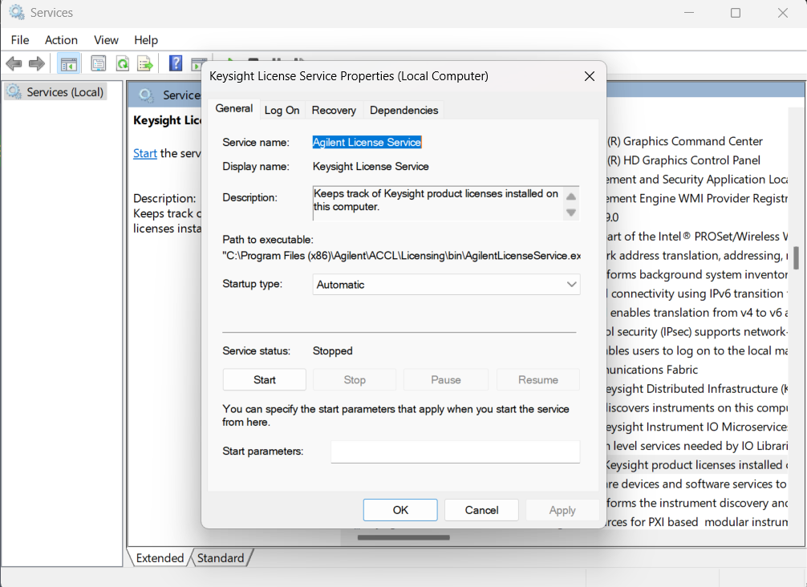
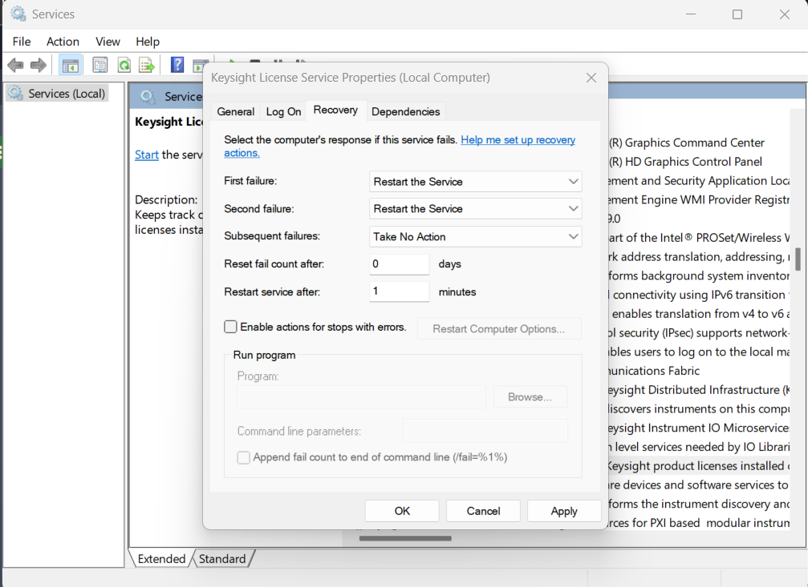

### Debugging guide
- If the Keysight Connection Expert fails to communicate with the VNA or
- IF the Connection expert is stuck in "Discovery" mode
- 
- Run the following steps:
    - WINDOWS: Launch the "services" tab from Windows search bar
    - Scroll down to "Keysight License Service" as shown here:
    - 
    - Check if it is running, if not switch to "Recovery" tab and change "First Failure" to "restart the service" as shown below
    - 
    - Hit Apply and OK
- Repeat above steps for "Agilent License Service" , "Keysight Instrument Discovery" , and "Agilent Instrument Discovery" as well.
- If they are stopped, ensure to click "Start" and "Apply +OK"
- A detailed guide to the Debugging steps is found here: https://shorturl.at/F1gNO
- Please refer to Pages: 36 (Keysight License /Benchvue Server), 
- Page 60, 70 (Keysight License Server), 90 for help.
- The video for debuggin steps, recorded over a call with Keysight support staff is here: https://drive.google.com/file/d/1WjOr8GrWHIcjuN8HagfZRAdoC49OEynx/view?usp=sharing.
- If all else fails; DO A CLEAN UNINSTALL AND DEEP CLEAN following the steps here: https://shorturl.at/Bq5bT

